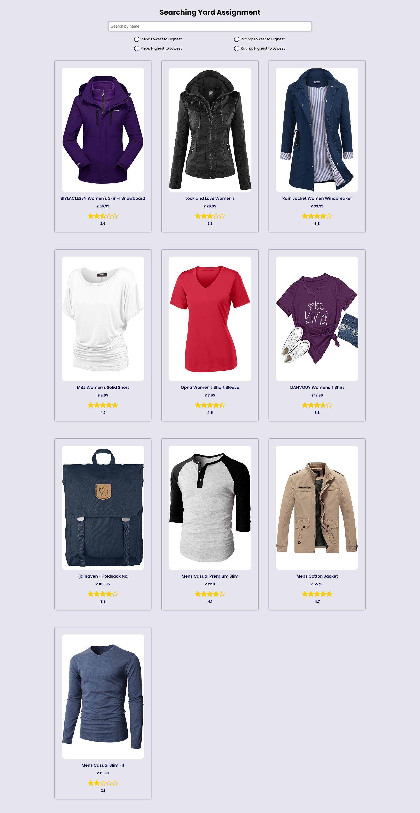

# Searching Yard Assignment

## React-Vite Product Search and Sorting App


This is a simple product search and sorting app built with React, Typescript, and Styled Components. It fetches product data from the [Fake Store API](https://fakestoreapi.com/) and allows users to search and sort products based on various criteria.


## Features

<ul>
    <li>Fetches product data from the Fake Store API</li>
    <li>Allows users to search products by title</li>
    <li>Displays product search suggestions in real-time</li>
    <li>Allows users to sort products by price or rating</li>
    <li>Fully responsive design</li>
</ul>

## Getting Started

To get started, clone this repository and install the dependencies:

```js
git clone https://github.com/sidhant2709/searching-yard-assignment.git
cd searching-yard-assignment
yarn install
```

Then start the development server:

```js
yarn run dev
```

This will start the app on http://localhost:5173

<hr>

## If you want to use Redux

Paste the below code in the  [main.tsx](./src/main.tsx) file

```js
  import React from "react";
  import ReactDOM from "react-dom/client";
  import App from "./AppRedux";
  import "./index.css";
  import { Provider } from "react-redux";
  import store from "./store/store";

  ReactDOM.createRoot(document.getElementById("root") as HTMLElement).render(
    <React.StrictMode>
      <Provider store={store}>
        <App />
      </Provider>
    </React.StrictMode>
  );
```
<hr>


## Tech Stack

<ul>
    <li>React</li>
    <li>Vite</li>
    <li>TypeScript</li>
    <li>Styled Components</li>
    <li>Axios</li>
    <li>Redux</li>
</ul>

## Dependencies
This app uses the following dependencies:

<ul>
    <li>axios: For making HTTP requests</li>
    <li>react: For building user interfaces</li>
    <li>react-dom: For rendering components to the DOM</li>
    <li>styled-components: For styling React components</li>
    <li>typescript: For adding static types to Javascript</li>
    <li>Redux-ToolKit: for state management</li>
</ul>


## API Used
This app fetches product data from the [Fake Store API](https://fakestoreapi.com/), a free public API for testing and prototyping e-commerce applications.

## Folder Structure

* [searching-yard-assignment](https://github.com/sidhant2709/searching-yard-assignment)
    * [public](./public/)
    * [src](./src/)
        * [store](./src/components/)
            * [store.ts](./src/store/store.ts)
            * [productSlice.ts](./src/store/productSlice.ts)
        * [components](./src/components/)
            * [Loader.tsx](./src/components/Loader.tsx)
            * [ProductGrid.tsx](./src/components/ProductGrid.tsx)
        * [styles](./src/styles/)
            * [pageStyle.ts](./src/styles/pageStyle.ts)
        * [types](./src/types/)
            * [types.ts](./src/types/types.ts)
        * [App.tsx](./src/App.tsx)
        * [AppRedux.tsx](./src/AppRedux.tsx)
        * [App.css](./src/App.css)
        * [index.css](./src/index.css)
        * [main.tsx](./src/main.tsx)
    * [index.html](./index.html)
    * [tsconfig.json](./tsconfig.json)
    * [README.md](./README.md)
    * [package.json](./package.json)
    * [tsconfig.json](./tsconfig.json)
    * [README.md](./README.md)


## Contributing
Pull requests are welcome. For major changes, please open an issue first to discuss what you would like to change.

Please make sure to update tests as appropriate.

## License
[MIT](https://choosealicense.com/licenses/mit/)


## Screenshot



## React Vite

To Create a project in vite go to the link [Vite](https://vitejs.dev/guide/)

```js
# npm 6.x
npm create vite@latest my-react-app --template react-ts

# npm 7+, extra double-dash is needed:
npm create vite@latest my-react-app --template react-ts

# yarn
yarn create vite my-react-app --template react-ts

# pnpm
pnpm create vite my-react-app --template react-ts

```